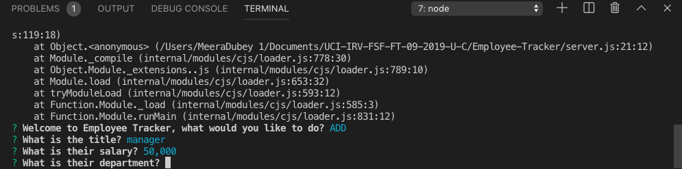

# Employee-Tracker
The Employee-Tracker allows the user to use command-line application to add/view departments,roles, employees, and update employee roles. Three tables hold the information regarding departments, roles, and employees and then copied to mysql to run the database. You must install a package.json using npm i through node.js in terminal. 
